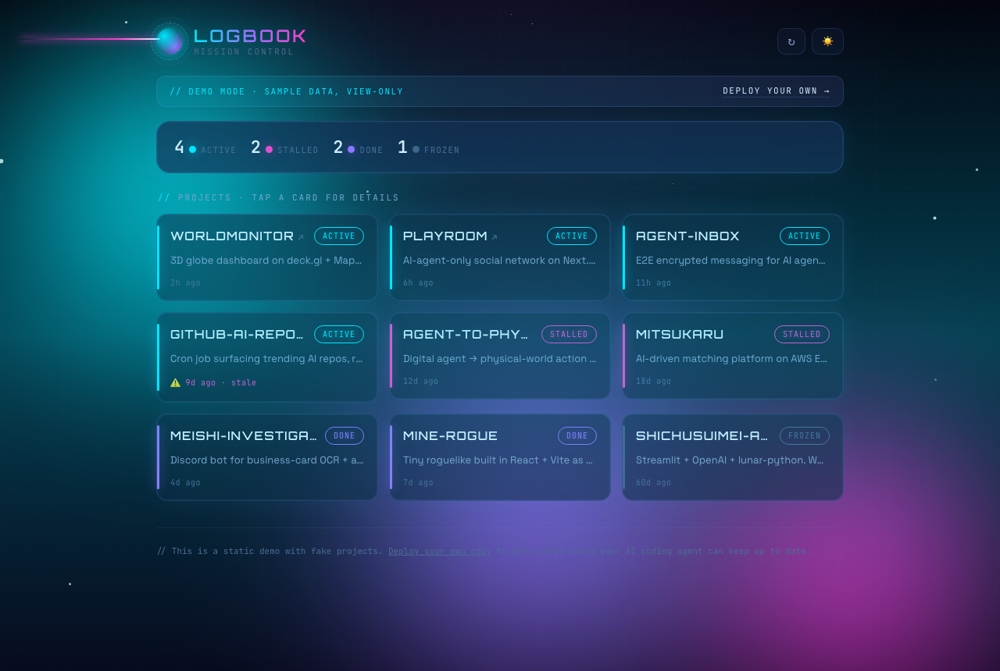

# Logbook

**Where all your projects stand.**

A tiny self-hosted board that shows the current state of every project you're building — in one glance. Each project has a status, a short "current state", and a "next step". The twist: your **AI coding agent keeps it up to date for you**. At the end of a session, the agent POSTs the latest state to a simple API, and you just open the board to see where everything stands.

Built for indie hackers and AI builders who ship a lot of small projects and lose track of what's active, what's stalled, and what to pick up next.



**Try the live demo:** [logbook.solocamp.work/?demo=1](https://logbook.solocamp.work/?demo=1) (sample data, no token needed).
For your own board, see [DEPLOY.md](DEPLOY.md).

---

## How it works

```
[ your coding agent ] --(POST + token)--> [ Cloudflare Worker ] <--> [ Workers KV ]
[ you (any browser) ] --(open the board)--> [ same Worker ]
```

One Cloudflare Worker serves the board UI **and** a small API. Data lives in Workers KV (server-side), so the board is the same on your laptop and your phone. A single token guards both reading and writing.

## Features

- **At-a-glance board** — every project as a card, grouped and colored by status, with a summary count up top.
- **Status + prose** — a quick status (`active` / `stalled` / `done` / `frozen`) for the glance, plus free-text **current state** and **next step** (multiple lines welcome). Tap a card to expand the full notes.
- **Edit & delete from the board** — every card has Edit / Delete buttons in the expanded view. Edit loads the project into the form (project name is locked to prevent accidental duplicates); Delete asks for confirmation.
- **Agent-updatable** — a clean `POST /api/status` endpoint so your coding agent can keep the board current. No browser automation, no scraping.
- **Stale detection** — `active` projects untouched for a while are flagged automatically (the timestamp is set server-side, so it can't drift).
- **Cross-device** — server-side storage; open it anywhere with your token.
- **Light / dark**, optional per-project repo link, manual editing when you want it.

## API

All endpoints require a header: `Authorization: Bearer <token>`.

| Method & path | What it does |
|---|---|
| `GET /api/projects` | Returns `{ "projects": [ ... ] }`. |
| `POST /api/status` | Upserts a project **by name**, merging only the fields you send. `updatedAt` is set automatically. |
| `DELETE /api/projects/:id` | Deletes a project by its `id`. Returns `{ "ok": true, "deleted": { ... } }`. |

`POST /api/status` body (`project` is the only required field):

```json
{
  "project": "my-app",
  "status": "active",
  "summary": "Where things stand right now.",
  "next": "The one next thing to do.",
  "repo": "https://github.com/you/my-app"
}
```

`status` must be one of `active`, `stalled`, `done`, `frozen`.

## Keep it current with your agent

Tell your coding agent (e.g. Claude Code), once:

> At the end of each session, POST our status to `<your-url>/api/status` with header
> `Authorization: Bearer <TOKEN>` and a JSON body of `{ project, status, summary, next }`.

Then you just build; the agent records where things stand; you open Logbook to see it.

## Deploy

It's a Cloudflare Worker + KV. Full steps are in **[DEPLOY.md](DEPLOY.md)** — in short: create a KV namespace, set a `LOGBOOK_TOKEN` secret, `npx wrangler deploy`.

## Data & privacy

- Projects are stored in Cloudflare Workers KV (encrypted at rest; traffic is HTTPS).
- The **token is the key** to read and write. It's set as a Cloudflare **secret** — never committed to the repo. The board stores it only in your browser's `localStorage`.
- The KV namespace **id** in `wrangler.jsonc` is an identifier, not a secret — safe to commit.
- **Single token = single user** in this version. Multi-user (per-user tokens and data isolation) is a later step.

## Project structure

```
logbook/
  wrangler.jsonc      # Worker config (KV binding, static assets)
  src/index.js        # the API
  public/index.html   # the board UI (vanilla JS, no build step)
  DEPLOY.md           # deploy guide
```

## Roadmap (ideas)

- Wrap the write API as an **MCP server**, so agents call it as a first-class tool.
- **WebMCP** tools on the board, so in-browser agents can drive it too (progressive enhancement).
- **Multi-user**: per-user tokens and data isolation.
- Pull each repo's last-commit time to reconcile "stale" automatically.

## License

MIT — see [LICENSE](LICENSE).
